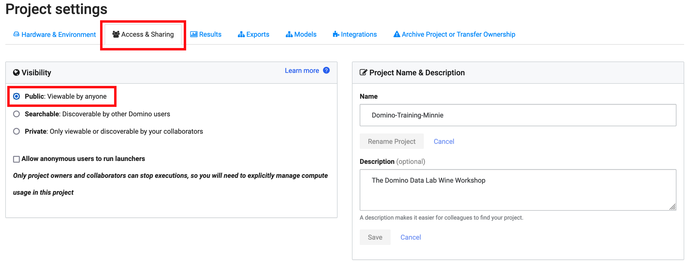
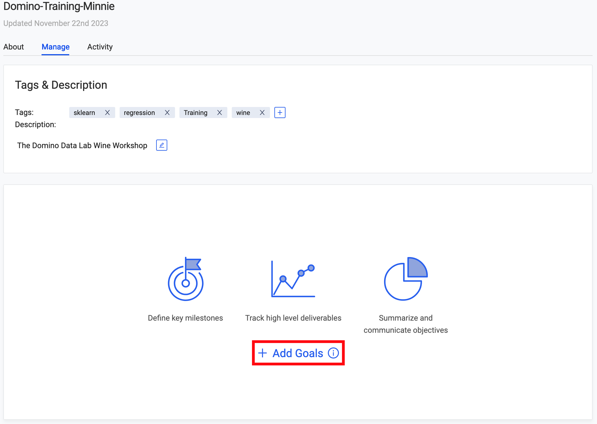

## Domino Hands-On Workshop: Predicting Wine Quality

#### In this workshop you will work through an end-to-end workflow broken into various labs to -

* Read in data from a live source
* Prepare your data in an IDE of your choice, with an option to leverage distributed computing clusters
* Train several models in various frameworks
* Compare model performance across different frameworks and select best performing model
* Deploy model to a containerized endpoint and web-app frontend for consumption
* Leverage collaboration and documentation capabilities throughout to make all work reproducible and sharable!


## Section 1 - Project Set Up

### Lab 1.1 - Forking Existing Projects
Once you have access to the Domino training environment use the search bar to discover any projects tagged for 'Training'

Select the project called WineQuality

<!--  -->

<p align="center">


</p>

Read the readme to learn more about the project's use case, status, etc.

In the top right corner, choose the icon to **fork** the project. Name the project *yourname-Domino-Training*

<!--  -->

<p align="center">


</p>

In your new project - go into the settings tab

View the default hardware tier and compute environment - ensure they are set to 'Small' and 'Workshop-Environment' respectively:

<!--  -->

<p align="center">


</p>

Go the access and sharing tab - change your project visibility to **Public**

<!--  -->

<p align="center">


</p>

Add your instructor or another attendee as a collaborator in your project. 
<!--  -->

<p align="center">


</p>

Change their permissions to results consumer.
<!--  -->

<p align="center">


</p>

### Lab 1.2 - Defining Project Goals

Click back into the Overview area of your project. Then navigate to the manage tab.

Click on add some goals

<!--  -->

<p align="center">


</p>

For the goal title type in 'Explore Data' and click save. Once the goal is saved click the drop down on the left to mark the goal as in 'Data Acquisition and Exploration' status.


<!--  -->

<p align="center">


</p>

[optional] - Add a comment to the goal and tag a collaborator you've added earlier by typing @ then their username

<!--  -->

<p align="center">


</p>

### Lab 1.3 - Add Data Source

We will now add data connection defined by an admin to our project to later query in data. To do so - navigate to the Data tab of your projects

<!--  -->

<p align="center">


</p>

Select the 'domino-winequality-workshop' s3 bucket connection and click add to project

<!--  -->

<p align="center">


</p>


This concludes all labs in section 1 - Prepare Project and Data! 

## Section 2 - Develop Model

### Lab 2.1 - Inspect Compute Environment
Click on the cube icon on the far left sidebar of the UI

Select 'Domino-Workshop-Environment' 

Inspect the dockerfile to understand the python & R packages installed, configurations specified, kernels installed etc. 

Scroll down to Pluggable Workspaces Tools - this is the area in the compute environment where IDEs are made available for end users


Scroll down to the Run Setup Scripts section

Here we have a script that executes upon startup of workspace sessions or job (pre-run script) and a script that executes upon termination of a workspace session or job (post-run script) 

Click on the revisions tab - here you can see all the versions of an environemnt that have existed over time. You can see who built which version and, if you are permissed to do so, you can select 
which revesion becomes the active version

Finally navigate to the projects tab - you should see all projects that are leveraging this compute environment. Click on your project to navigate back to your project. 


Click into the Workspaces tab to prepare for the next lab.

### Lab 2.2 - Exploring Workspaces

In the top right corner click Create New Workspace

Click the Workspace Environemnt dropdown to browse all avaiable Compute Environments - ennsure that Domino-Workspace-Environment is selected.

Select JupyterLab as the Workspace IDE

Click the Hardware Tier dropdown to browse all available hardware configurations - ensure that Small is selected. 

Click Launch now.


Once the workspace is launched, create a new python notebook by clicking here:

When you have your notebook loaded, click on the Data tab, then onto the data source we added in lab 1 as displayed below -

Copy the provided code snippet into your notebook and run the cell

After thats run copy the code below into a following cell - 

```python
from io import StringIO
import pandas as pd

s=str(objects[0].get(),'utf-8')
data = StringIO(s) 

df=pd.read_csv(data)
df.head()
```

### Lab 2.3 - Syncing Files
